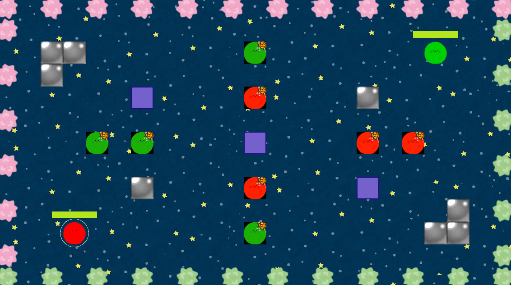
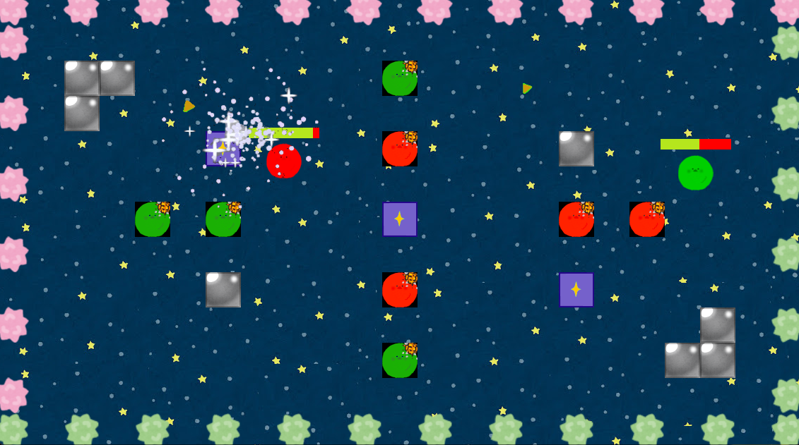

# コリジョンカオス

## URL

未定

## ゲーム概要

キャラクターを弾いて相手とぶつけ合うスリリングなゲームです。

ゲーム画面には回復やダメージを受けるブロックがあります。

自分のキャラクターを上手に動かして、ブロックを利用して戦略的に相手に攻撃しましょう。

## 開発環境

★言語

　C、C++、GO

★ゲームエンジン

　Cocos2dx

★使用ソフト

　GIMP

★外部ライブラリ

　rapidjson
 
　https://rapidjson.org/

## 設計書

[クラス図.xlsx](./クラス図.xlsx)

[シーケンス図.xlsx](./シーケンス図.xlsx)

[システム構成図.xlsx](./システム構成図.xlsx)

## 操作機能

タップ

## ゲーム詳細

★メイン画面

　ゲームが起動すると、メイン画面が表示します。
 
　メイン画面をタップすると、ゲーム待機画面へ遷移します。

★ゲーム待機画面

　ゲーム待機画面にプレイヤーがいない場合、部屋を作成します。

　待機部屋に２名参加するとゲーム画面に遷移します。

 ★ゲーム画面

　プレイヤーを弾いて、相手にダメージを与えます。
 
　ダメージの与え方は、相手プレイヤーをダメージブロックに当てたり、

　相手プレイヤーダメージブロックに当たるとダメージを与えれます。

　
　
